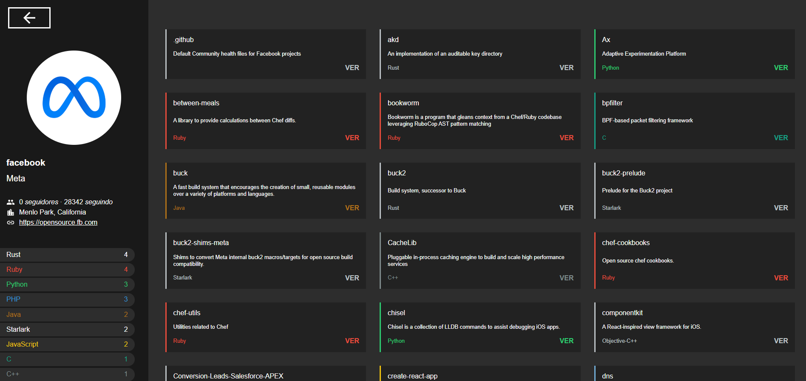

# 📌 API GitHub  

## 📖 Descrição  

Projeto desenvolvido para consumir a API do GitHub, permitindo a pesquisa de usuários.  

## 🚀 Funcionalidades  

- Busca de usuários no GitHub 
- Exibição das informações do perfil pesquisado  
- Interface responsiva e intuitiva  

🔗 **[Demonstração do Projeto](https://api-git-hub-sigma.vercel.app/)**  

  

## 🛠️ Tecnologias Utilizadas  

- [React](https://reactjs.org/)  
- [Styled Components](https://styled-components.com/)  

## 📌 Pré-requisitos  

Antes de iniciar o projeto, certifique-se de ter os seguintes requisitos instalados:  

- **Node.js** (versão 14 ou superior)  
- **npm** (gerenciador de pacotes do Node.js, geralmente incluído na instalação)  

## ⚙️ Instalação e Uso  

Siga os passos abaixo para configurar e rodar o projeto localmente:  

1. **Clone o repositório:**  
    ```bash
    git clone https://github.com/TGuapyassu/ApiGitHub.git
    ```  

2. **Acesse o diretório do projeto:**  
    ```bash
    cd ApiGitHub
    ```  

3. **Instale as dependências:**  
    ```bash
    npm install
    ```  

4. **Inicie o servidor de desenvolvimento:**  
    ```bash
    npm run start
    ```  

Agora, o projeto estará disponível em:  
👉 `http://localhost:3000`  
